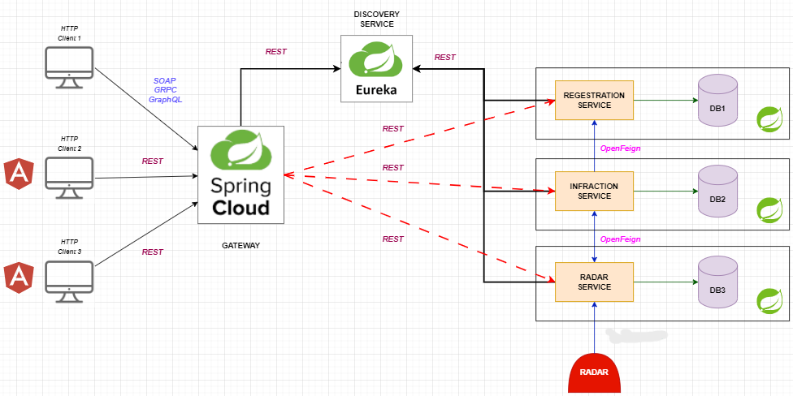
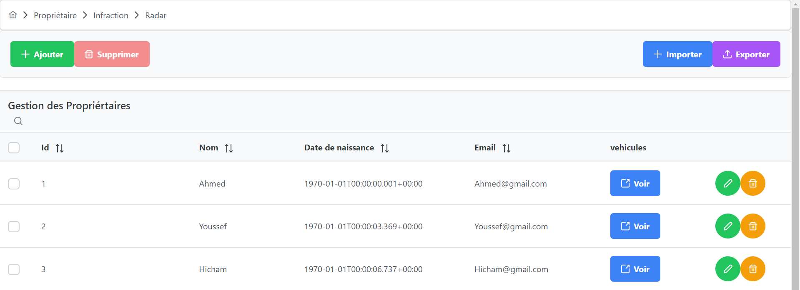
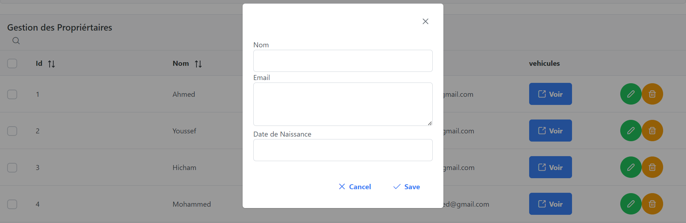
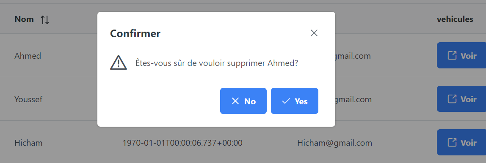
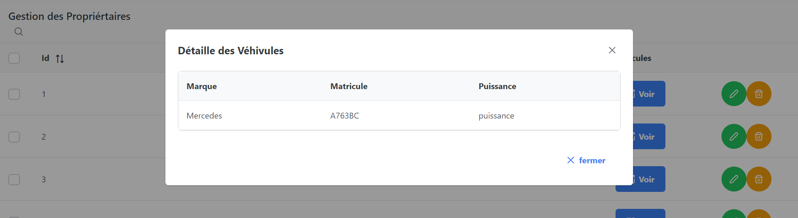
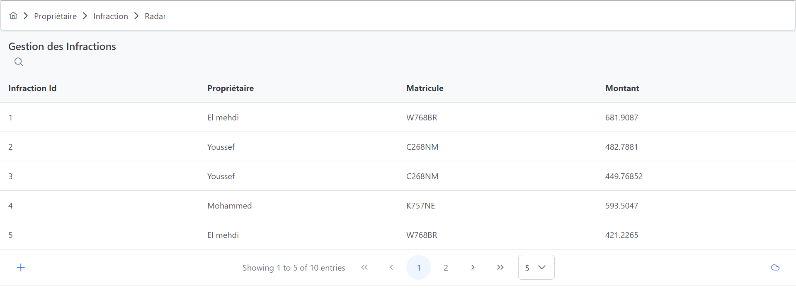
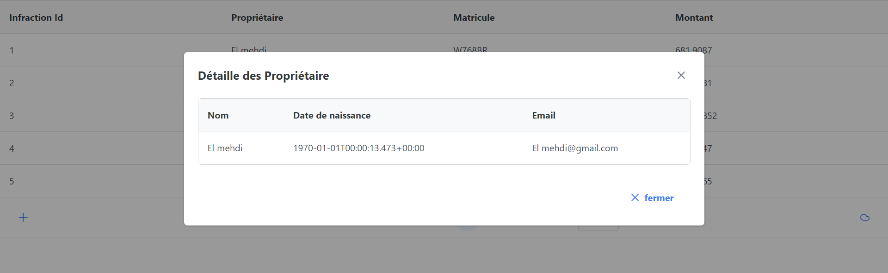
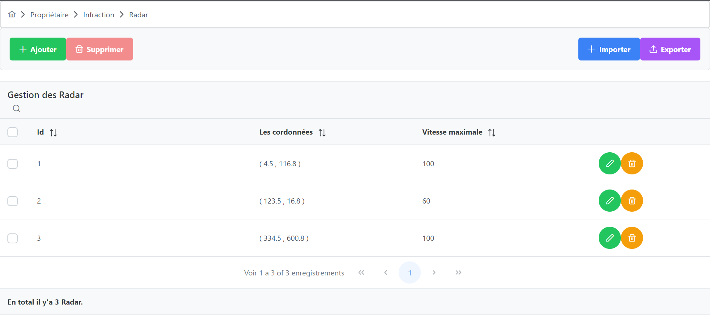
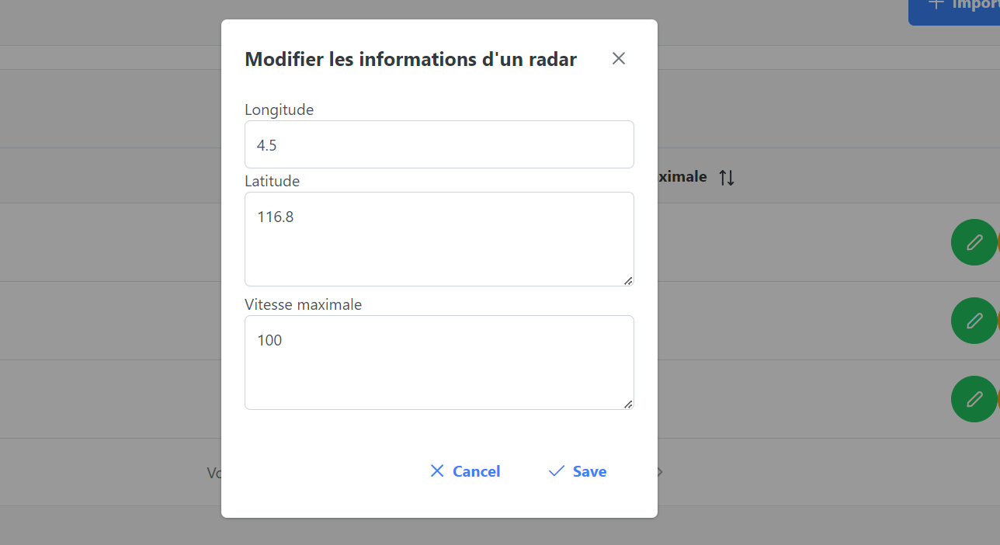

<h1>Rapport du projet</h1>
<h2>Réaliser par: EL KARI El mehdi</h2>
 

 

<h3>I-Architecture logiciel</h3>
</img>

<h3>II-Diagramme de classe</h3>
</img>

<h3>III-Les interfaces graphique</h3>

<h4>III-1 Propriétaire</h4>
L'interface Propriétaire permet aux l'administrateur d'effectuer différentes actions liées à la gestion des propriétaires.
<h5>ِConsulter l'ensembles des propriétaires</h5>
</img> 
<h5>Ajouter ou modifier un propriétaire</h5> 
</img>
<h5>Supprimer un propriétaire</h5>
</img>
<h5>Voir les véhicules d'un propriétaire</h5> 
</img>

<h4>III-2 Infraction</h4>
L'interface Infraction permet aux l'administrateur d'effectuer différentes actions liées à la gestion des infractions.
<h5>ِConsulter l'ensembles des infractions</h5>
</img>
<h5>Consulter Détaille d'un propriétaire</h5> 
</img>

<h4>III-3 Radar</h4>
L'interface Radar permet aux l'administrateur d'effectuer différentes actions liées à la gestion des radars.
<h5>ِConsulter l'ensembles des radars</h5>
</img>
<h5>Ajouter ou modifier un radar</h5> 
</img>
<h5>Supprimer un radar</h5>
</img>

